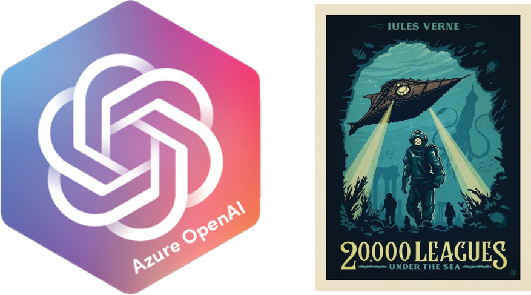

# Azure OpenAI - Progressive Document Summarization

<b>[OpenAI's](https://openai.com/) state-of-the-art language processing models offer users new capabilities to generate concise, meaningful summaries of long-form documents. [Microsoft's new Azure OpenAI service](https://azure.microsoft.com/en-us/products/cognitive-services/openai-service/) allows enterprises the ability to leverage these ML capabilities to support enterprise workloads while being backed by the [security and responsible use promise](https://learn.microsoft.com/en-us/legal/cognitive-services/openai/data-privacy?context=%2Fazure%2Fcognitive-services%2Fopenai%2Fcontext%2Fcontext) of working the in the Microsoft cloud.</b>

For businesses, consolidating complex long-form documents into concise, digestible summaries can provide new insights across different domains and stands to transform traditional business processes. While OpenAI's transformer models are extremely powerful, they currently are limited in how much data can be summarized in a single request.

Here, we showcase a recursive approach where multiple documents can be summarized progressively to create wholistic narratives. As a source text (or for our purposes, a collection of "documents") we are working from [Jules Verne's manuscript for '20,000 Leagues Under the Sea' available in the public domain via the Gutenberg Project](https://www.gutenberg.org/files/164/164-h/164-h.htm). 

Within the sample notebook in this repo [`Verne.ipynb`](Verne.ipynb) each chapter of Verne's work is retrieved as a separate document. In our recursive processing routine we summarize each chapter, then consolidate the responses, and finally generate a wholistic summary of the entire novel (shown below).

  

<b>20,000 Leagues Under the Sea - OpenAI Generated Summary:</b>

> Pierre Aronnax, a professor from the Museum of Natural History in Paris, joins an expedition to hunt a giant narwhal in the North Pacific Ocean. After three months of searching, the crew spots the narwhal and prepares for battle. Pierre and Conseil are lost at sea after the frigate they were on collides with the narwhal. They are rescued by a submarine boat and taken to the Nautilus, a powerful submarine vessel owned by Captain Nemo. The vessel is powered by electricity and is equipped with a kitchen, bathroom, and berthroom. The passengers explore the ocean floor and a submarine forest, encountering a variety of flora and fauna. They navigate the dangerous waters of the Torres Straits and the Indian Ocean, encountering various species of fish, molluscs, and zoophytes. They pass by the reefs where Captain Cook's vessel was lost and eventually enter the Mediterranean. The Nautilus is pursued by a warship, which Nemo sinks, and the crew eventually escapes in a boat. Pierre Aronnax and his companions experience a thrilling journey under the sea, encountering a variety of sea creatures and marveling at the wonders of the ocean.

While we demonstrate this mode of OpenAI-based processing to summarize a historical work of fiction here, it can easily be extended and applied to a number of enterprise scenarios.
